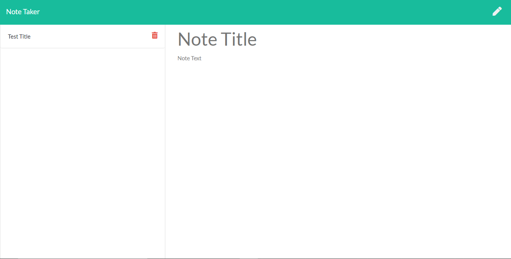

# HWNoteTaker

## Homework Assignment
This is the homework assignment for "Unit 11 Express Homework: Note Taker". The assignment is to *Create an application that can be used to write, save, and delete notes. This application will use an express backend and save and retrieve note data from a JSON file.*

## Description
This is a node application to take notes and save them in a JSON file. If the user wants to delete them, they can click on a button next to the note list and delete it.

Typing inside the **Note Title** and **Note Text** will allow you to save the note to the list on the left side. When clicking the button, the index.js file will send a ajax post request to "/api/notes" with the data inside. The program will save the info, add it to the list, then delete and rewrite the db.json file with the new array. Afterwards it sends a res.json(true) to let index.js continue with rendering and updating the page.

A similar path is true for deleting a note. When clicking on the delete icon, index.js sends an id number through the route. Saving that number in a variable, we look it up through a for loop and when found, delete and save it to the json file. Afterwards, it sends a res.json(true) to let index.js continue with rendering and updating the page.